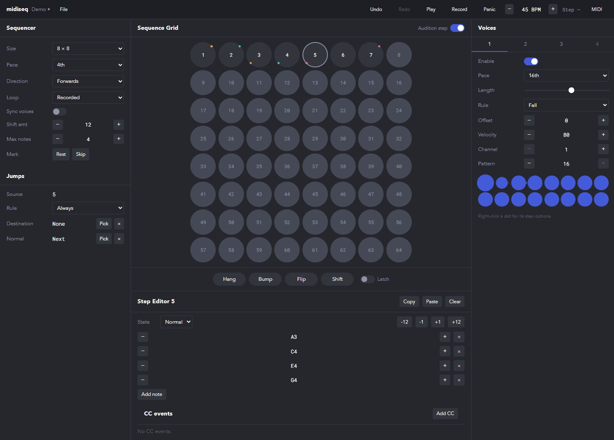

# midiseq

A browser MIDI step sequencer with **decoupled voices** and **conditional
jumps**. The sequencer walks a grid of polyphonic steps at its own pace, while
four voices read whatever step is current at *their* own paces, each with its
own rhythm pattern and note-picking rule. The result is a small amount of
input turning into a lot of music.

It sends MIDI to anything on your machine — [Signal](https://signalmidi.app),
a DAW, or hardware — and records from any MIDI keyboard.



Reading the window above: the **sequencer** and its **jumps** are on the left,
the **grid** and the selected step's **editor** in the middle, and the four
**voices** on the right. The coloured dots on steps 1–4 are jumps — each pair
shares a colour, marked at the source's top right and the destination's bottom
left. Step 5 is selected, and its four notes are listed below the grid.

## Requirements

- **Chrome or Edge.** Firefox asks for permission each session; Safari has no
  Web MIDI at all.
- **Node 22** (or 20.19+) to run it.
- **A MIDI port.** On Windows that usually means
  [loopMIDI](https://www.tobias-erichsen.de/software/loopmidi.html) — a free
  virtual cable — unless you have hardware plugged in. Browsers can't create
  ports of their own.

## Running it

```bash
npm install
npm start
```

Then open the address it prints — http://localhost:3000, or the next free
port if something else already has it — and allow MIDI when the browser asks.

## Setting up MIDI

midiseq makes no sound itself; it plays other instruments.

1. **Make a port.** In loopMIDI, add a port and call it something like
   `midiseq out`. Add a second one if you also want to receive clock later.
2. **Point something at it.** In Signal, open its MIDI settings and enable
   `midiseq out` as an input. In a DAW, arm a track whose input is that port.
3. **Choose outputs in midiseq.** Open the **MIDI** menu in the app bar and
   set **All** to your port. That single stream carries every voice.
   - Each voice can go to its *own* port instead, so four instruments can be
     played at once. Leave those as None to use the All stream.
   - The All stream is tidied up: two voices playing the same note at the same
     moment send one note-on, and a note is released only when the last voice
     holding it lets go.
4. **Choose an input** in the same menu if you want to record: pick your
   keyboard's port and a channel, or Omni for any.

If the menu says MIDI is blocked, allow MIDI devices in the browser's site
settings (the icon at the left of the address bar), then press **Enable MIDI**.

## Using it

**Transport.** **Play** starts the sequencer and **Record** arms recording;
stopping also silences anything still sounding. The tempo can be stepped or
typed straight into. **Clear all**, **Undo** and **Redo** sit beside the File
menu on the left.

**Recording.** Arm **Record**, click the step you want to start from, and play.
A step fills to **Step notes** — four by default, one for each voice — and only
then does the target move on, so it fills whether you play a chord or one note
at a time. Turn Record off when you're done.

**The grid.** Each circle is a step holding up to four notes, one for each
voice to draw from, and any number of CC envelopes. Clicking one selects it, sounds it, and shows it in
the step editor. While the sequence is playing, clicking queues that step
next instead. Turn **Audition step** off if you'd rather click silently.
The grid and the step editor scroll together: as you scroll down, the grid
stays at the top and shrinks to a compact size, and the editors carry on
underneath it.

**Clock.** midiseq sends MIDI clock — start, stop and 24 ticks a beat — to
every ticked output, so anything listening follows its tempo. In
**Settings → MIDI** you can turn that off, and you can have midiseq take its
*tempo* from a clock arriving at a ticked input instead. Only the tempo:
start and stop are ignored, so playing and stopping stay yours.

**The step editor** lists the selected step's notes by name, so you can add,
remove, retune or transpose them by hand. A note can be typed as well as
stepped — `G#5`, or just `D` to stay in the octave it is already on. Steps
can be copied and pasted.

**Velocity & CCs.** Under the notes, each voice has a **Velocity** tab: a line
with a point at every note it plays on the step, edited like a CC envelope.
Drag a point, or the line between two, to set those notes' velocities; click
a point to return its note to the voice's velocity; in **Draw**, drag across
the notes to paint them. Points come from the notes, so none can be added.
Drop a point near a dashed line and it snaps onto that accent; anywhere else the dot keeps a velocity of its own, and
grows or shrinks for whichever level it is nearest. How far an accent reaches
is **Settings → General → Accent amount**. A Velocity tab's row sets its
voice's velocity; a CC's sets its number and channel.
When there are more tabs than fit on the row, the rest wait in a menu at its
end, beside the **+**; the open tab always stays on the row.

CCs each get a tab too, with their own number and channel, and an envelope: a
line of breakpoints drawn across the step, over a piano roll of the notes the
step plays. In **Edit**, click the line to add a point, or
double-click anywhere; drag a point, or drag the line to raise it; click a
point to delete it. In **Draw** (press **B** with the graph focused), drag to
paint values across the grid. Points snap to the grid unless you hold **Alt**.
An envelope sends its first value as the sequencer lands on the step, then
follows its line until the next.

**Voices.** Each of the four voices has its own pace, gate length, note-picking
rule (up, down, random, highest, and so on), octave offset, velocity, channel
and rhythm pattern. Because voices run at their own pace, a single chord step
can become an arpeggio, a bass line and a lead at once. Right-click any
pattern dot for its step options: articulation, accent, velocity, ratchet,
probability and condition. A velocity typed there is kept exactly — an accent
only if it lands on one. The dot then shows what it carries. Clicking or right-clicking
a dot also selects its voice; clicking a row's number selects the voice
without changing any dots.

**Jumps** are what make a sequence wander. Any step can jump to any other step
when its rule passes — always, every third visit, 25% of the time, and so on.
A jump draws as a coloured pair in the grid: the source marked at its top
right, the destination at its bottom left. Failed jumps fall through to the
next step, or to a "normal" step you choose. A step has one jump, added in the
step editor with **+ Jump rule** beside **+ Add note**: one row holds its rule
and the destination and normal step, each picked from the grid with its
crosshair button, and its **X** takes the whole jump away.

**Narrow windows.** Below 1200px wide, the Sequencer settings leave their own
column and become a tab beside Voices, on the left, with the grid on the
right. Below 876px everything shares one column, with a tab each for the
Grid, Voices and Sequencer.

**Actions** change the sequence as it plays, held down or latched:

| | |
|---|---|
| **Hang** | the step stops advancing while the voices keep playing |
| **Bump** | flips Sync Voices, so voices restart with each step, or don't |
| **Flip** | swaps the grid's rows and columns |
| **Shift** | transposes new notes by the Shift amount |

**Saving.** **File → Save** writes a `.midiseq.json` file. In Chrome and Edge
it saves straight back to the file you opened. The title shows a dot while
there are unsaved changes, and the working patch is kept in the browser every
few seconds, so a crash doesn't lose it.

## Keyboard

| Key | Does |
|---|---|
| `Ctrl+Z` / `Ctrl+Shift+Z` | undo / redo |
| `Ctrl+S` / `Ctrl+Shift+S` | save / save as |
| `Ctrl+O` | open |
| `H` `B` `F` `S` | hold Hang, Bump, Flip, Shift |

## Development

| Command | Does |
|---|---|
| `npm start` | dev server |
| `npm test` | all tests |
| `npm run typecheck` | `tsc --noEmit` everywhere |
| `npm run check` | Biome lint and format |

- `packages/core` — the sequencer itself: entities, the engine, patch
  commands and the file format. No React, no MobX, fully unit-tested.
- `app` — the React app: MobX for the patch, jotai for view state, Tailwind
  for styling, and the services that talk to Web MIDI.

The engine works in floating-point beats and hands the player timestamped
events; the player schedules about 100 ms ahead from a Web Worker, so playback
keeps time even when the tab is in the background.
