# PUNCHER

A browser MIDI step sequencer with **decoupled voices** and **conditional
jumps**. The sequencer walks a grid of polyphonic steps at its own pace, while
four voices read whatever step is current at *their* own paces, each with its
own rhythm pattern and note-picking rule. The result is a small amount of
input turning into a lot of music.

It plays through a built-in SoundFont synth, and sends MIDI to anything on
your machine — [Signal](https://signalmidi.app), a DAW, or hardware — and
records from any MIDI keyboard.

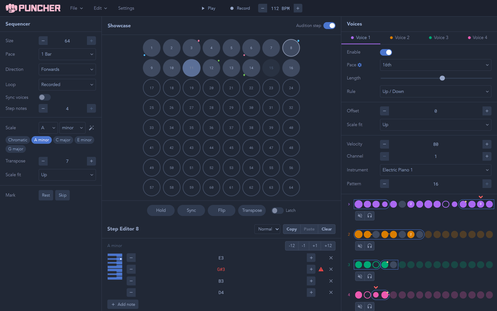

Reading the window above: the **sequencer**'s settings are on the left, the
**grid** and the selected step's **editor** in the middle, and the four
**voices** on the right. The coloured dots on steps 3, 8 and 12 are jumps —
each pair shares a colour, the source marked at its top right and the
destination at its bottom left, so 3 jumps to 6, 8 to 1 and 12 to 14. Step 11
is a rest and step 15 a skip. Step 8 is selected, and its four notes are
listed below the grid, the G#3 in red as it's outside the patch's A minor.
The outlined runs of dots are the ones each voice plays on that step, and the
chevrons above two of them mark voices sounding the same note at once.

## Requirements

- **Chrome or Edge.** Firefox asks for permission each session; Safari has no
  Web MIDI at all.
- **Node 20.19+ or 22.12+** to run it.
- **A MIDI port**, to play other instruments. On Windows that usually means
  [loopMIDI](https://www.tobias-erichsen.de/software/loopmidi.html) — a free
  virtual cable — unless you have hardware plugged in. Browsers can't create
  ports of their own. The built-in synth needs none; the first time it's
  switched on, it fetches Signal's factory SoundFont and keeps it in the
  browser.

## Running it

```bash
npm install
npm start
```

Then open the address it prints — http://localhost:3000, or the next free
port if something else already has it — and allow MIDI when the browser asks.

## Setting up MIDI

midiseq plays through its own built-in synth, through other instruments over
MIDI, or both. All of it is set in **Settings → MIDI**.

1. **To hear it straight away,** tick **Built-in synth** under **Outputs**.
   Each voice can then have an instrument of its own (see
   [The built-in synth](#the-built-in-synth)).
2. **To play something else, make a port.** In loopMIDI, add a port and call
   it something like `midiseq out`. Add a second one if you also want to
   receive clock.
3. **Point something at it.** In Signal, open its MIDI settings and enable
   `midiseq out` as an input. In a DAW, arm a track whose input is that port.
4. **Tick it under Outputs.** Every ticked output takes the whole sequence,
   each voice on a channel of its own — no two voices can share one — so one
   port can play four instruments, one to a channel.
   - Under **Voice outputs**, a voice can also go to a port of its own,
     alongside the ticked outputs. Leave the outputs unticked and give each
     voice a port to keep the four apart — though the steps' CCs and the
     clock go only to ticked outputs.
5. **To record,** tick your keyboard under **Inputs**; several can be ticked
   at once. The **Input filter** below decides what they may send in: which
   channels, which notes — a range, and a transpose — and which CCs.

If it says the browser blocked MIDI, allow MIDI devices in the site's
settings (the icon at the left of the address bar), then press **Try again**.
Until an output is ticked, the top bar says nothing is routed.

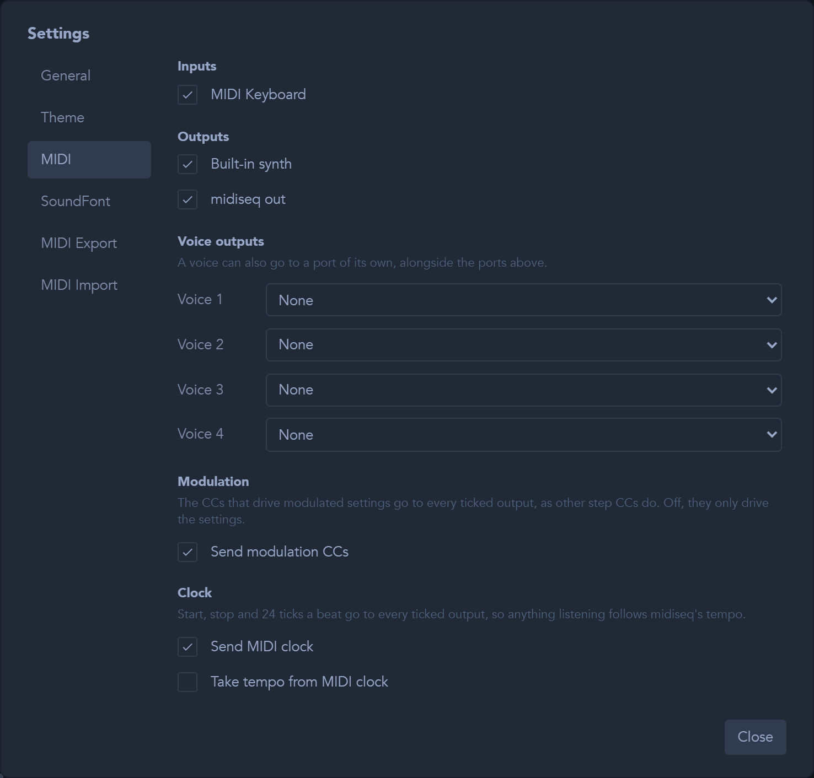

## Using it

### The window

**Transport.** **Play** starts the sequencer and **Record** arms recording;
**Stop**, in Play's place, also silences anything still sounding. The tempo,
20 to 400 BPM, can be stepped, dragged or typed straight into. On the left,
the **File** menu starts a new patch, opens and saves, imports MIDI, exports
it — the sequence or one step — and renders it to audio, the **Edit** menu
holds **Undo** and **Redo**, and **Settings** opens the settings. When
nothing seems to happen, the right of the bar says why: nothing is ticked to
play through, nothing to record from, or the built-in synth is still starting.

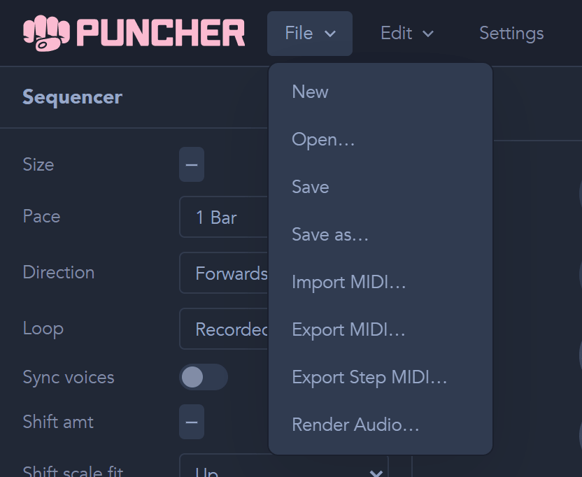

**Numbers.** A number can be stepped with its **−** and **+**, typed straight
into, or dragged up and down: slowly for one at a time, quickly to sweep its
range. A drag is one undo.

### The grid

Each circle is a step holding up to four notes, one for each voice to draw
from, and any number of CC envelopes; its number brightens once it has notes.
Clicking one selects it, sounds it, and shows it in the step editor. While
the sequence plays, a click also queues that step to come next — or, while
recording, moves where the recording goes. Turn **Audition step** off if
you'd rather click silently. The step playing lights up, and while recording,
the step being recorded into has a red ring. With **Audition step** on, the
step editor also follows the sequence as it plays, showing each step as it
sounds; turn it off to keep one step open while you edit.

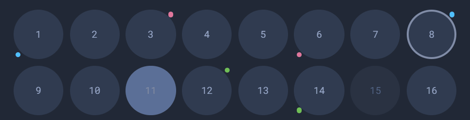

A step can be a **Rest** — visited, but silent bar its CCs — or a **Skip**,
never visited. Set it in the step editor, or press **Rest** or **Skip** beside
**Mark** and click steps in the grid to mark or unmark them, until it's
pressed again.
Any step can be dragged out of the grid as a MIDI file (see [Files](#files)).

The grid and the step editor scroll together: as you scroll down, the grid
stays at the top and shrinks to a compact size, and the editors carry on
underneath it; the action buttons, once under the grid, wait as icons in its
title bar. Once the envelope editor is all in view, scrolling on makes it
taller, its bottom staying at the window's, until the notes above it have
gone under the grid and it fills the view.

### The sequencer

Down the left are the sequencer's own settings:

- **Size** — how many steps the grid has, 1 to 64, laid out as near a square
  as they go. Steps past the size are kept for when it grows again.
- **Pace** — how long each step lasts, from 16 bars down to a 32nd-note
  triplet.
- **Direction** — Forwards, Backwards, Fwd / Bwd, Bwd / Fwd, Random, or
  Random+, which never plays the same step twice running.
- **Loop** — **Recorded** plays up to the last step with notes, CCs or a
  rest; **All** plays every step; **Custom** loops back after the
  **Loop end** you give it.
- **Sync voices** — every step starts each voice from the first dot of its
  pattern (see [Voices](#voices)).
- **Shift amt** — how far **Shift** transposes, up to 24 semitones either
  way.
- **Step notes** — how many notes a step holds, 1 to 4; recording fills a
  step to it.
- **Scale**, **Detected** and the scale fits — see [Scales](#scales).
- **Mark** — **Rest** and **Skip**, for marking steps in the grid.

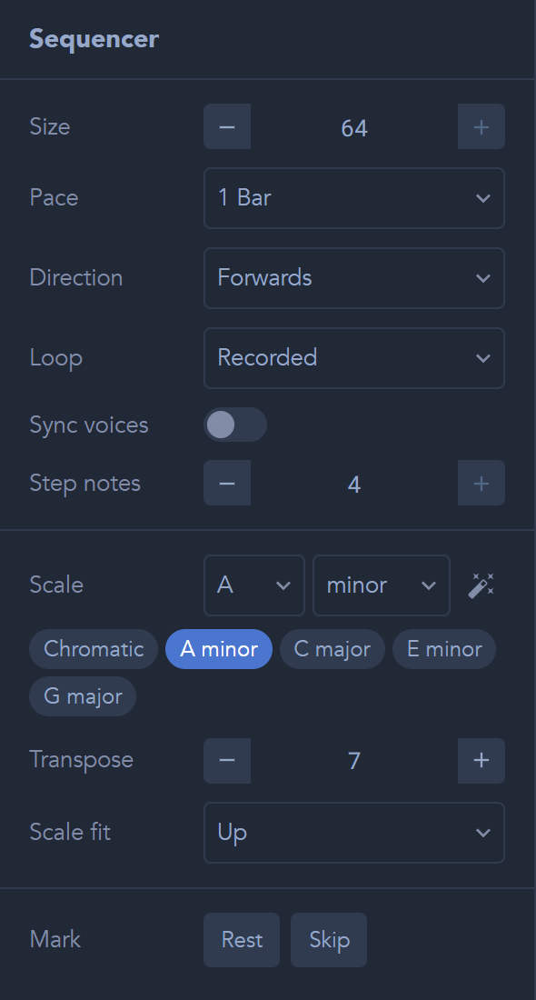

### Scales

Pick a scale under **Scale** — a tonic, and one of ten scales — or click one
of the **Detected** ones, up to four that best fit every note the steps hold.
The step editor then draws the scale's keys beside the notes and shows any
note outside it in red; notes entered by hand are let be, only marked. The
envelope editor's keyboard tints the keys in it.

Notes you record are fitted to it — moved up to the nearest note in it,
unless an import chose otherwise — and so is a note that a voice's
**Offset**, or **Shift**, moves out of it, as **Offset scale fit** and
**Shift scale fit** say: **Up** or **Down** to the nearest note in it,
**Exclude** to leave the note out, or **Ignore** to play it anyway. The fit
fields are off while there is no scale, unless a step can move the sequencer
to one.

The ten are major, minor, dorian, phrygian, lydian, mixolydian, harmonic
minor, the major and minor pentatonics, and minor blues — so that a
modulation can reach each of them at every tonic, and none, within a CC's
128 values. **Import MIDI** offers the whole library.

### The step editor

The step editor lists the selected step's notes by name, so you can add,
remove, retune or transpose them by hand — a note at a time, or all of them
by a semitone or an octave. A note can be typed as well as stepped — `G#5`,
or just `D` to stay in the octave it is already on. Its header makes the step
**Normal**, a **Rest** or a **Skip**, and copies, pastes or clears it. Lower
**Step notes** below what a step holds and the notes past it are dimmed and
silent, with **Trim to limit** to drop them.

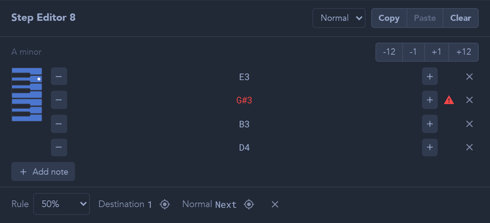

**Jumps** are what make a sequence wander. Any step can jump to any other step
when its rule passes — always, every third visit, 25% of the time, and so on.
A jump draws as a coloured pair in the grid: the source marked at its top
right, the destination at its bottom left. Failed jumps fall through to the
next step, or to a "normal" step you choose. A step has one jump, added in the
step editor with **+ Jump rule** beside **+ Add note**: one row holds its rule
and the destination and normal step, each picked from the grid with its
crosshair button, and its **X** takes the whole jump away. The rules are
**Always**; **1x**–**7x**, which pass that many times and then fail once;
**2:2**–**8:8**, which pass on the last of every two to eight visits;
**10%**–**90%**; and **Last** and **Not last**, which pass when the last jump
tried did, or didn't.

### Velocity & CCs

Under the notes, each voice has a **Velocity** tab: a lollipop for every note
it plays on the step — its head where the note starts, as high as it plays,
its stem as long as it sounds — over the other voices', dimmed. Drag a head or
stem up or down to set that note's velocity; click a head to return its note
to the voice's velocity; in **Draw**, drag across the notes to paint them. A
note's velocity is its dot's, so every note from that dot moves with it, and
as the notes come from the voices, none can be added. Drop a note near a
dashed line and it snaps onto that accent; anywhere else the dot keeps a
velocity of its own, and grows or shrinks for whichever level it is nearest.
How far an accent reaches is **Settings → General → Accent amount**. A
Velocity tab's row sets its voice's velocity; a CC's sets its number and
channel. When there are more tabs than fit on the row, the rest wait in a
menu at its end, beside the **+**; the open tab always stays on the row.

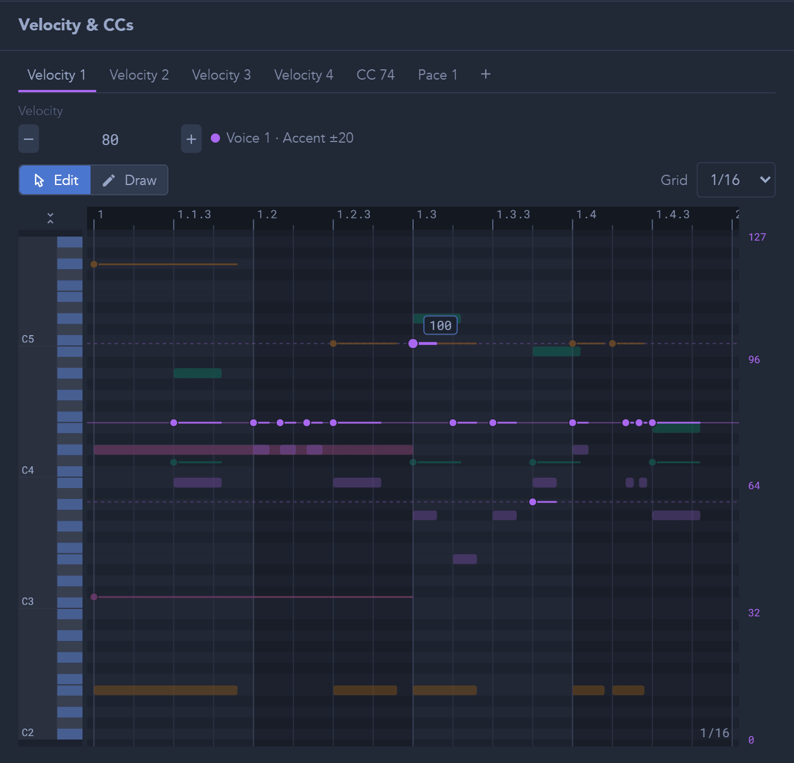

CCs each get a tab too, with their own number and channel, and an envelope: a
line of breakpoints drawn across the step, over a piano roll of the notes the
step plays. The **+** adds one, on the channel of the tab it's pressed from.
In **Edit**, click the line to add a point, or double-click anywhere; drag a
point, or drag the line to raise it; click a point to delete it. In **Draw**
(press **B** with the graph focused), drag to paint values across the grid.
Points snap to the **Grid**, 1/4 to 1/32 or triplets, unless you hold **Alt**.
Point at the line, or drag, and the value there shows beside the mouse. A CC
envelope **Steps** — each value holds until the next point, then jumps, as a
knob's messages do — or **Ramps**, running in straight lines from point to
point; pick one with the buttons beside **Draw**. New envelopes step, and a
knob recorded into one comes back as the steps it sent. Envelopes saved
before this choice existed ramp, as they always did.

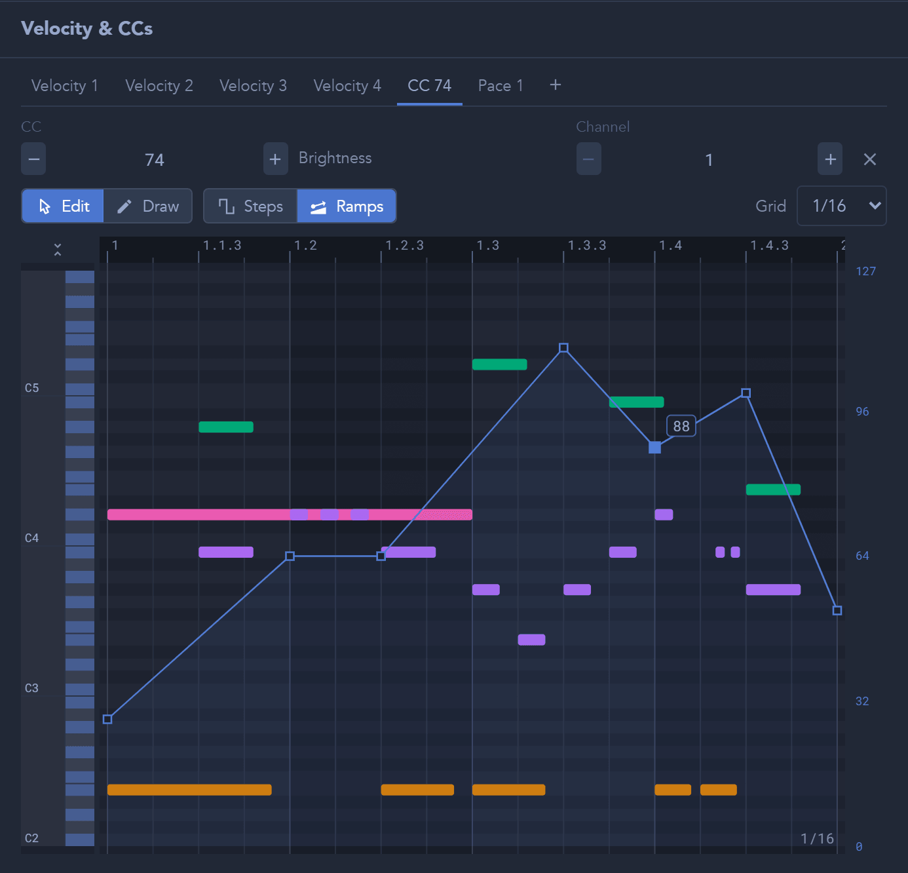

Down the left is a keyboard with a row for every key, black and white alike,
level with the roll's rows, and beside it a column ruling off each octave
under its C; the key under the mouse names itself. The button above it
collapses the scale to only the keys the sequence plays, and back. The roll's
columns shade in turn — by the bar zoomed out, by the beat or less zoomed in —
and the values read down the right in the envelope's colour, or a Velocity
tab's voice's. The ruler along the top counts the step in bars, beats and
sixteenths; drag on it to zoom and scroll as in Live — up zooms in around
where you pressed, down zooms back out, and sideways scrolls — one at a time,
changing over whenever the drag clearly turns. The pointer hides while you
drag, and a line through the roll marks where you pressed.

An envelope sends its first value as the sequencer lands on the step, then
follows its line until the next. The open tab stays open as you click from
step to step: on a step without that CC it shows an empty, dimmed lane, and
drawing into it adds the CC there. It stays open, too, as the editor follows
the sequence.

While the step on show sounds — played in the sequence, or clicked with
**Audition step** on — a yellow playhead crosses the roll in time with it.

### Voices

Each of the four voices has its own pace, gate length, note-picking rule (up,
down, random, highest, and so on), offset of up to 24 semitones either way,
velocity, channel and rhythm pattern — and, played through the built-in synth,
an instrument. Because voices run at their own pace, a single chord step can
become an arpeggio, a bass line and a lead at once.

Every voice's pattern shows at once, a row each, 1 to 16 dots long. Click a
dot to turn it on or off, or right-click it for its step options:
articulation, accent, velocity, ratchet, probability and condition. A
velocity typed there is kept exactly — an accent only if it lands on one. The
dot then shows what it carries: a ratchet's count inside it, an accent larger
or smaller, a probability under 100% hollow, a hold or tie a tail to the next
dot, solid or hollow, and a condition a mark at its corner. Clicking or
right-clicking a dot also selects its voice; clicking a row's number selects
the voice without changing any dots. The arrows under the rows export the
four voices — their patterns and settings — to a `.midiseqpat.json` file, to
try against another sequence, or import them in one undo, leaving the
sequencer and its steps as they are.

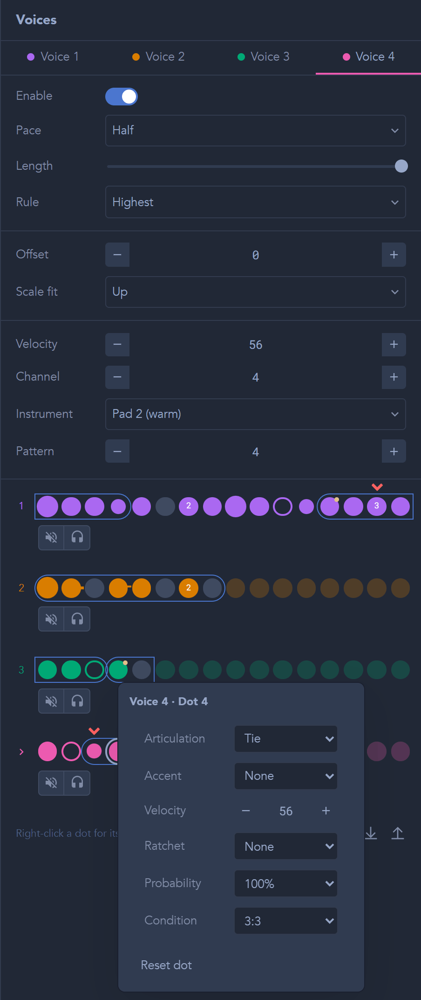

**Where a step comes in.** Voices run on through their patterns at their own
paces from step to step, so a step usually comes in partway through them —
with a bar-long step and 8th-note voices, step 1 plays dots 1–8 and step 2
dots 9–16. The outline around the dots in each pattern row marks the ones the
step plays: while playing, the step sounding; while stopped, the step in the
editor, as the sequence would first reach it. The piano roll and its Velocity
lanes show the same notes. **Sync voices** starts every step from the first
dots instead.

**Collisions.** When two or more voices sound the same note at the same time
on the step in the editor, the dots that played it get a small downward
chevron above them — one colour per collision, so separate ones stay apart.
Hover a marked dot to name the note and the other voices, and to set every
chevron of its collision bobbing.

### Actions

Actions change the sequence as it plays, for as long as a button or its key
is held — or, with **Latch** on, from one press until the next:

| | |
|---|---|
| **Hold** | the step stops advancing while the voices keep playing |
| **Sync** | the selected voice plays at the sequencer's pace, a note each step; let go, it picks its own pace up again |
| **Flip** | swaps the grid's rows and columns, from the next step on |
| **Shift** | transposes new notes by the Shift amount |

### Modulation

A CC can drive a setting from the steps: a voice's pace, length, rule,
offset, offset scale fit and pattern, and the sequencer's size, pace,
direction, loop mode, shift amount, shift scale fit, step notes and scale.
Hover a setting's label and a gear appears beside it. Click
it to choose the CC — it offers the next one MIDI leaves undefined that
nothing in the patch uses yet — and the range the CC's 0 to 127 runs across,
from one of the setting's values to another, then **Modulate**. The CC's tab
opens on the step in the editor, scrolled into view, with an envelope starting
at the setting's own value, so nothing changes until it is drawn on. A step
with an envelope for that CC plays the setting as the envelope has it; every
other step plays the field's own value. Down the envelope's right side the
numbers give way to the setting's values — paces, rules, scales — its points
snap to them, and a dashed line marks the field's own value. A step lasts as
long as the sequencer's pace as it lands; the voices follow their envelopes as
they play. Size, Direction and Loop are read from the outgoing step at each
transition; the first step starts from the saved settings. Shift amount and
Step notes follow the envelope as notes play, with Shift amount applying
while Shift is on. Modulating Size or Step notes keeps the stored steps and
notes; Loop changes the mode while keeping the custom loop end.
While the sequence plays, a modulated field shows the value the
sounding step's envelope has it at, in the envelopes' colour, and goes back to
its own value on a step without one. Point at the field, or use it, and it
shows its own value again, which is the one it changes. A modulated setting's
gear stays lit, and clicking it again lists the steps it is on, changes the CC
or the range — the envelopes follow, keeping the values they stood for as far
as the new range reaches — shows its envelope on the step in the editor, or
removes the modulation, which leaves the envelopes as plain CCs. Removing the
last of its envelopes in the envelope editor removes the modulation too, and
the gear goes back to hiding. Two settings can't share a CC. A knob recorded
on the CC lands on the setting's values. The envelope goes out as its CC as
well, unless **Send modulation CCs** is off in Settings → MIDI; an export
leaves them out when its **Modulation CCs** box is cleared, and names the
setting beside each one.

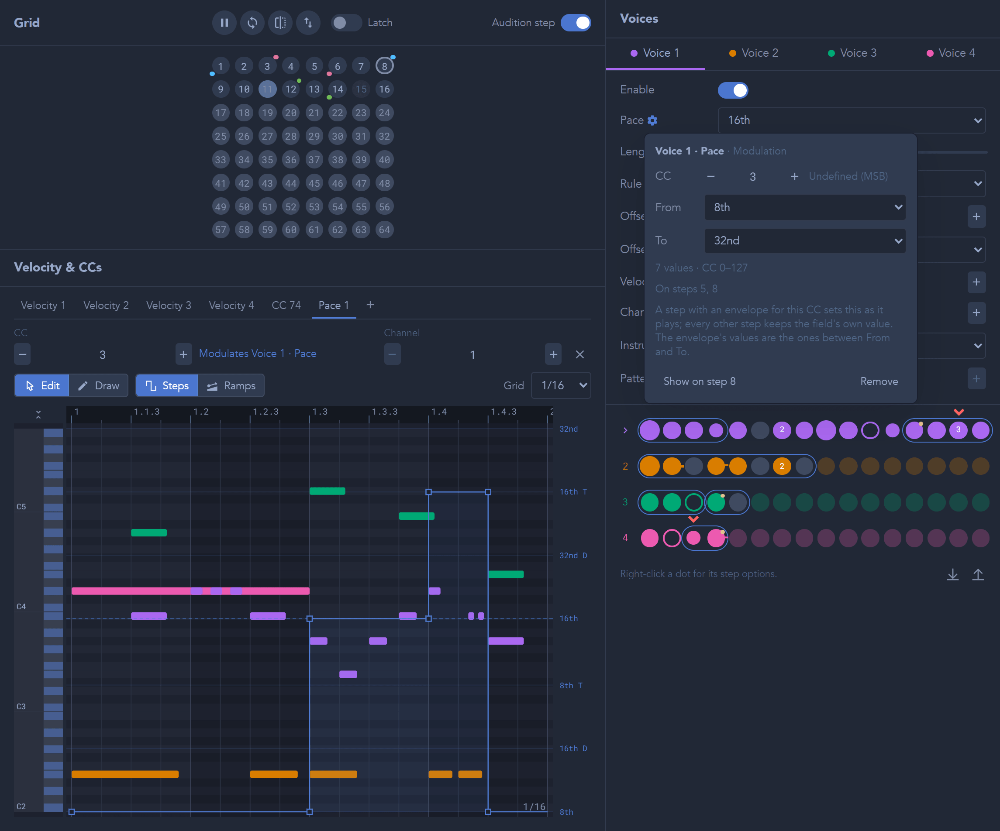

The actions can be driven the same way. Hover **Hold**, **Sync**, **Flip** or
**Shift** under the grid and a gear appears at its corner; the title bar's
icons have none. An action's envelope is Off or On, and a step with one turns
the action on or off whatever its button says: Hold and Flip as the step ends
— a step whose envelope has Hold on at its end is kept until the envelope
changes or the sequence stops — Sync as the step lands, and Shift at each
note. Every other step leaves the action to its button. Sync's gear is the
selected voice's, so each voice is synced on steps of its own. While the
sequence plays, a button a step's envelope drives shows it on or off in the
envelopes' colour, until it is pointed at or pressed.

### Recording

Arm **Record**, click the step you want to start from, and play. A step fills
to **Step notes** — four by default, one for each voice — and only then does
the target move on, so it fills whether you play a chord or one note at a
time; a key the step already holds adds nothing. With a scale set, what you
play is fitted to it (see [Scales](#scales)). Turn a knob and it records too,
into that CC's envelope: while the sequence plays, as a curve on the step you
hear it on, from the moment it moved; while stopped, spread across the record
step in the order you turned it. An envelope keeps its timing if you change
the pace afterwards: a shorter step plays what fits, a longer one holds the
last value. Turn Record off when you're done; pressing Play, starting a new
patch, opening or saving one, clearing the step or importing MIDI ends the
take too, and a take is one undo. Knob messages that aren't a control's
position — All Sound Off, All Notes Off and the other channel-mode messages,
bank select, and RPN/NRPN data entry — are left out, so a DAW's start/stop
burst can't fill a step with tabs.

### Files

**Saving.** **File → Save** writes a `.midiseq.json` file. In Chrome and Edge
it saves straight back to the file you opened; elsewhere it downloads a copy.
**New** and **Open** ask before throwing away unsaved changes, and so does
closing the tab. The working patch is kept in the browser every ten seconds,
so after a crash it comes back as it was.

**Import MIDI.** **File → Import MIDI…** reads a MIDI file into the steps,
saying it is reading while it does. Its dialog keeps the scale and a preview
of the file in view at the top while its options — which fold away, like its
MIDI filter, leaving a line that sums them up — scroll underneath. The preview
is a piano roll whose ruler zooms and scrolls it just as the envelope editor's
does — drag up to zoom in, down to zoom out, sideways to scroll. On the ruler
sits the stretch to import: drag its handles, which snap to bars or beats, or
the stretch itself. Tick the tracks to import (each track's notes on each
channel; ticking several merges them) and the CCs, and choose how many notes a
step takes, the step to start from, and how softly a note may be played and
still go in. The notes that start in the stretch go into the steps in the
order they play, that many to a step — a chord lowest first, each key once a
step, however long the notes last — and shaded bands on the preview,
numbered where there's room, show which notes land in which step. The same
**MIDI filter** as the MIDI input's — channels, note range, transpose and CCs
— starts from your input's settings and can be changed for the import alone,
its note range by the handles beside the preview's keys as well: notes it
keeps out show gray and aren't counted, as do notes too soft or that the
scale leaves out. Notes that would go past the end of the grid, whatever its
size, show red. The dialog says which steps they fill, and how many notes
don't fit; **Loop until the grid is full** goes round them again, and the
file's tempo can come too.

The scale starts as the patch's own, with the scales that best fit the file's
notes beside it to pick from. Notes outside it move **Up** or **Down** into
it, are left out (**Exclude**), or are let be (**Ignore**), and the dialog
counts them. The CCs become stepped envelopes over each step's notes. The
steps filled lose what they held, the notes a step becomes **Step notes**, the
scale becomes the patch's, the pace is left alone, and one undo takes the
import back; the grid's steps bounce in as it lands. Where it starts — leaving
out the drum channel, bringing in CCs, looping, taking the tempo, the softest
note that goes in, and what the stretch snaps to — is set in
**Settings → MIDI Import**.

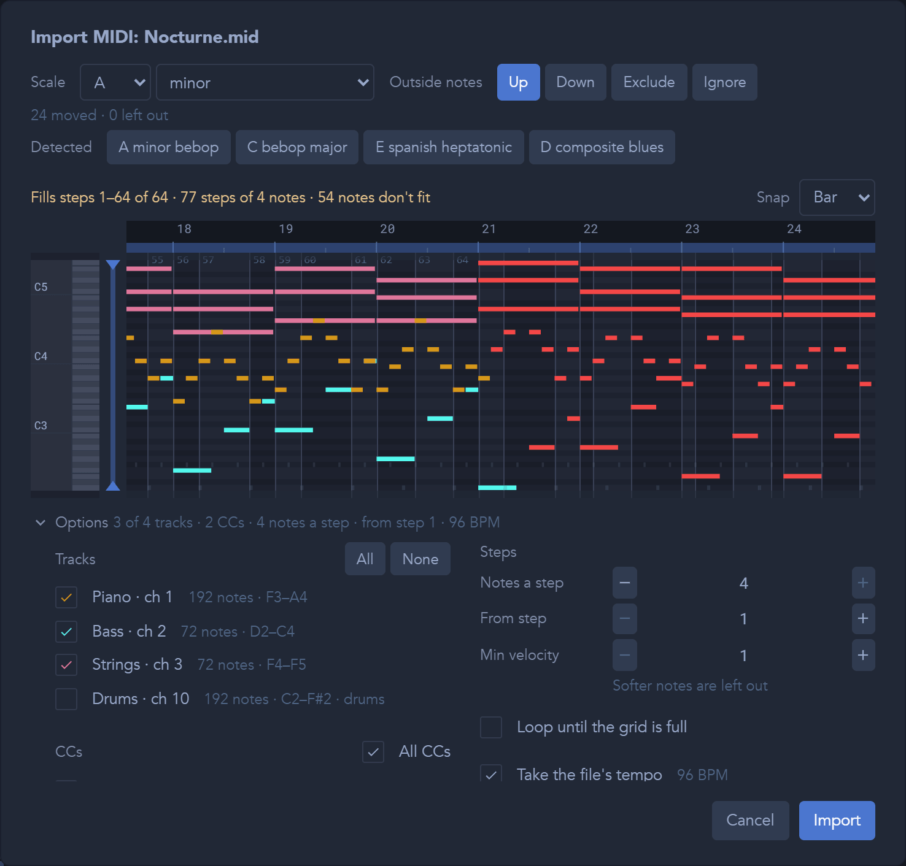

**Export MIDI.** **File → Export MIDI…** writes the sequence as a standard
MIDI file, as it plays from its start. Tick the voices to include — each on
its own channel, with its instrument set — and the CCs: every controller the
sequence sends is listed by number and channel, with **All CCs** to tick or
clear the lot. Put each voice on a track of its own, with the CCs on one more,
or everything on one track. Choose how many passes through the sequence to
write; the dialog shows how many steps and bars that comes to, and how long it
lasts. **File → Export Step MIDI…** does the same for the step in the editor
alone: a step long, as the sequence first reaches it, with that step's CCs.

These choices are kept, and shared: the two export dialogs and
**Settings → MIDI Export** all show and change the same ones. They're also
what a step dragged out of the grid holds — drag any step onto your desktop, a
folder or another app and it lands as that step's MIDI file, straight away.
Dragging a file out needs Chrome or Edge. It's worked out instantly and
silently, nothing is sent to your outputs, and chance and the random rules are
rolled afresh each time, as they would be in a performance.

**Render Audio.** **File → Render Audio…** plays the sequence from its start
through the built-in synth's SoundFont — the one chosen in
**Settings → SoundFont**, whichever outputs you play through — and writes it
as a WAV or MP3 file. Name the file, then choose the format, the sample rate
(44.1 or 48 kHz), the bit depth for a WAV (16-bit, 24-bit, or 32-bit float) or
the bitrate for an MP3 (128–320 kbps), stereo or mono, how many passes, and a
tail of up to ten seconds for the last notes and the reverb to ring out; the
dialog shows how long that comes to. **Normalize**, on by default, brings the
loudest moment up to −1 dB, as the synth on its own plays well under full
level. **Render** asks where the file goes, then renders on a thread of its
own, so the app stays responsive, showing how far along it is — loading the
SoundFont, rendering, encoding — until the file is written. **Cancel** stops
it. Chance and the random rules are rolled afresh, as for an export; the
choices are kept for next time.

<p>
  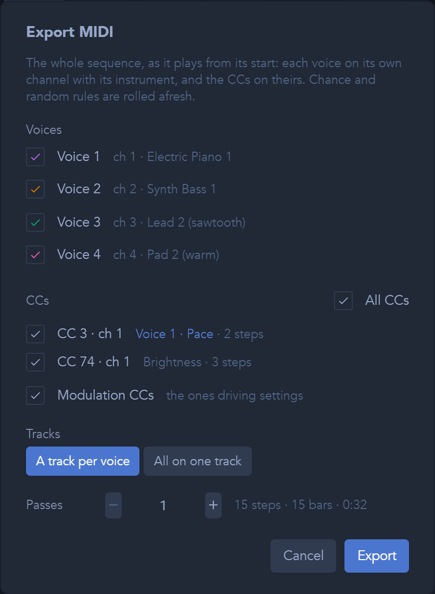
  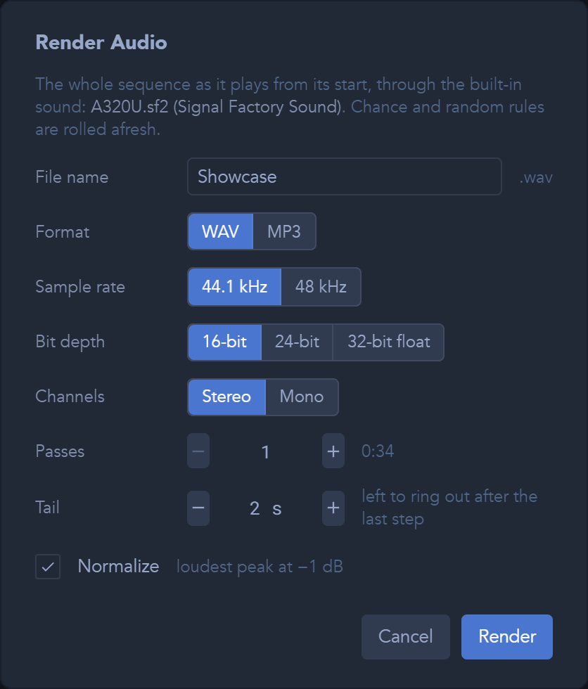
</p>

### The built-in synth

Tick **Built-in synth** among the outputs in **Settings → MIDI** and midiseq
plays on its own, each voice with a General MIDI instrument of its own, chosen
under **Instrument** in the Voices panel. It plays Signal's factory SoundFont,
A320U by Milton Paredes (GNU GPL v2), fetched the first time it's wanted and
kept in the browser; its sound starts with your first click or key press, as
browsers ask. **Settings → SoundFont** lists it, and any SF2, SF3 or DLS files
you **Add**, which are kept in the browser too; the one chosen is what the
synth and **Render Audio** play.

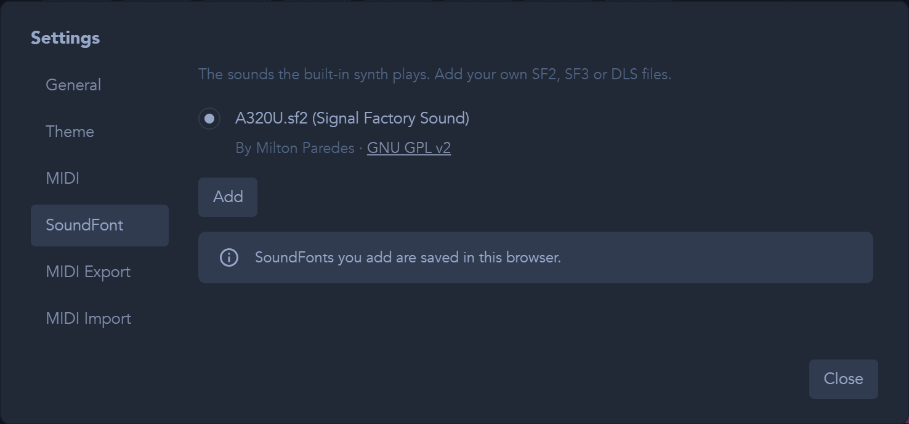

### Clock

midiseq sends MIDI clock — start, stop and 24 ticks a beat — to every ticked
output, so anything listening follows its tempo. In **Settings → MIDI** you
can turn that off, and you can have midiseq take its *tempo* from a clock
arriving at a ticked input instead. Only the tempo: start and stop are
ignored, so playing and stopping stay yours.

### Themes

**Settings → Theme** goes **Light**, **Dark**, or **System**, which follows
your computer's light or dark setting. Under it you pick the dark theme and
the light theme to wear, each from the themes of its kind: thirteen dark and
nine light, the two defaults and twenty made from VS Code themes (see
[Development](#themes-1)).

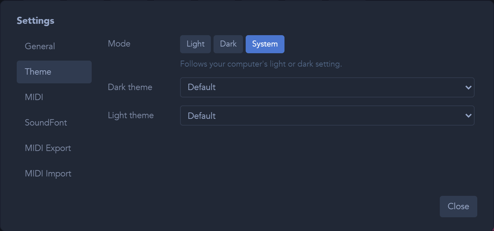

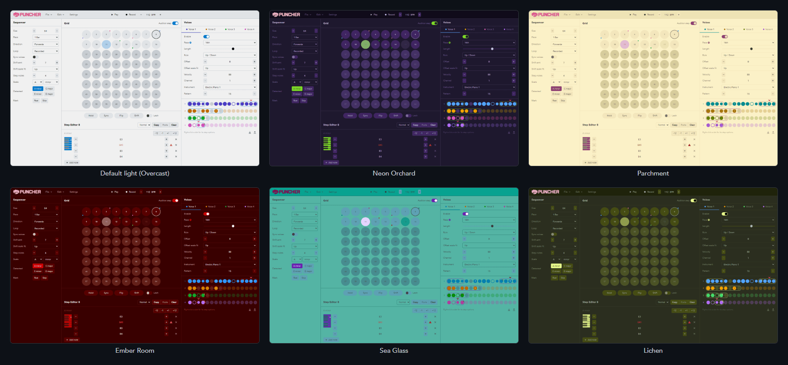

<details>
<summary>Every theme</summary>

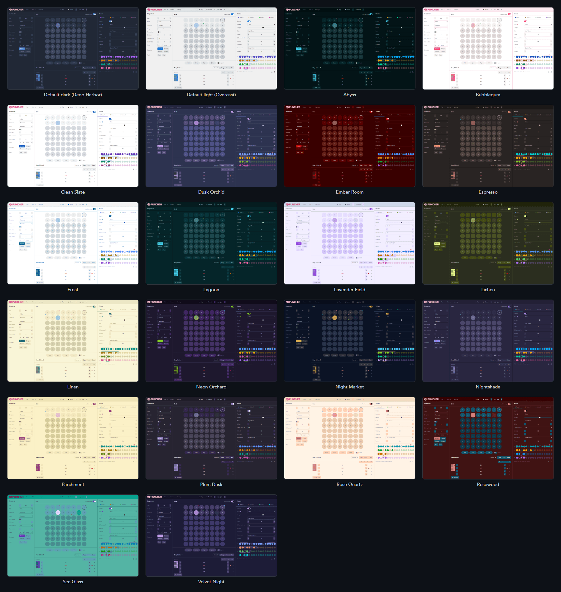

</details>

### Narrow windows

Below 1200px wide, the Sequencer settings leave their own column and become a
tab beside Voices, on the left, with the grid on the right. Below 876px
everything shares one column, with a tab each for the Grid, Voices and
Sequencer.

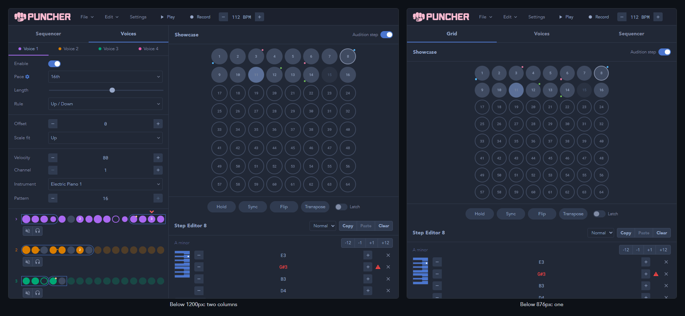

## Agents

midiseq offers itself to AI agents in the browser through
[WebMCP](https://webmachinelearning.github.io/webmcp/), so an agent can read
the sequence and write it while you watch: the steps, the voices, the
sequencer's settings, modulations, the transport, recording and the actions.
What it changes shows as it lands, with the step or voice it changed
selected, and each change it asks for is one entry in the undo history, like
any of yours — **Edit → Undo** takes it back. Saving, opening and exporting
stay yours, as do the settings, and while an agent can start recording, only
you can play into it.

WebMCP is new. Chrome has it behind `chrome://flags/#enable-webmcp-testing`,
which is enough on localhost, and in an origin trial for a site that's
deployed. Where the browser has no WebMCP, nothing is offered.

| Tool | Does |
|---|---|
| `get_sequence` | reads it all: settings, voices and patterns, every step holding anything, the transport, the selection |
| `set_steps` | notes, rests and skips, jumps and CC envelopes, on any number of steps at once |
| `set_voices` | a voice's settings, its pattern and its dots' options |
| `set_sequencer` | tempo, size, pace, direction, loop, scale and the rest of the Sequencer panel |
| `set_modulations` | binds a setting to a CC, as its gear does, so the steps' envelopes drive it |
| `step_menu` | what right-clicking a step offers: copy, paste, insert before or after, clear, delete |
| `play`, `stop` | the transport |
| `set_recording` | the **Record** button, and the step recording goes into |
| `set_actions` | Hold, Sync, Flip and Shift, on until turned off |
| `select_step` | what a click on the grid does: shows the step, sounds it, or plays it next |
| `undo`, `redo` | **Edit → Undo** and **Redo** |
| `clear_sequence` | empties the steps and resets the voices |

Steps, voices and dots are numbered from 1, as the app shows them, and notes
are named, C4 being middle C. A call asking for something the app can't do
changes nothing and says why, so the agent can put it right.

[WEBMCP.md](WEBMCP.md) has more: how to try the tools, what each one takes,
a worked example, and how it's built.

## Keyboard

| Key | Does |
|---|---|
| `Ctrl+Z` / `Ctrl+Shift+Z` or `Ctrl+Y` | undo / redo |
| `Ctrl+S` / `Ctrl+Shift+S` | save / save as |
| `Ctrl+O` | open |
| `H` `Y` `F` `S` | hold Hold, Sync, Flip, Shift — or, with Latch on, turn them on and off |
| `B` | Draw, and back to Edit, with the envelope graph focused |
| `Alt` | points and strokes off the grid, while dragging or drawing |
| `Esc` | closes a dialog, menu or popup |

On a Mac, `⌘` stands in for `Ctrl`.

## Development

| Command | Does |
|---|---|
| `npm start` | dev server |
| `npm run build` | production build |
| `npm test` | all tests |
| `npm run typecheck` | `tsc --noEmit` everywhere |
| `npm run check` | Biome lint and format |
| `npm run format` | Biome format, rewriting files |
| `npm run theme -- <theme.json>` | a theme from a VS Code theme (below) |

- `packages/core` — the sequencer itself: entities, the engine, patch
  commands, the file format, and MIDI files and messages. No React, no MobX,
  fully unit-tested.
- `app` — the React app: MobX for the patch, jotai for view state, Tailwind
  for styling, the services that talk to Web MIDI, and the built-in synth.

The engine works in floating-point beats and hands the player timestamped
events; the player schedules about 100 ms ahead, ticked from a Web Worker, so
playback keeps time even when the tab is in the background.

### Themes

Every colour is a CSS variable, and a theme is a set of them selected by
`data-theme` on the page. The defaults, Deep Harbor for dark and Overcast for
light, live in `app/src/styles.css`. More can be made from any VS Code colour
theme:

```bash
npm run theme -- path/to/theme.json --name "Midnight"
```

The theme's JSON can have comments, as VS Code's often do. The name defaults
to the theme's own, or else its file's; `--id` and `--type dark|light`
override what the utility works out. It needs Node 22.18 or later, which runs
the TypeScript as it is.

The two don't name the same things, and most VS Code themes set only some of
their colours, so nothing is copied across one for one. A layout of the
same kind, in `app/src/theme/layout.css`, is the pattern: how much darker
the ruler is than the background, how far secondary text sits from primary,
which hue each voice and jump has. That layout is rebuilt on the VS Code
theme's background, text and accent. A VS Code colour is taken wherever it
plays the same part and sits where ours does, the title bar for the top bar
say, and the rest is tinted with the theme's hue.

The accent, the colour controls light when they're on, is the theme's own
mark for what's active: the active activity-bar or tab border, then its
button and badge. Red is left to recording unless the theme's buttons are red
themselves. A CC's envelope is drawn in the accent too. The voices take the
theme's chart colours, then its terminal's blue, yellow, green and magenta,
then its nearest syntax colours. Jumps and collision marks come from the
brights instead: the bright colours of every VS Code theme kept, gathered
into `app/src/theme/brights.ts`, so they stand out the same way whichever
theme is on. Each takes the bright nearest its built-in hue, no two alike,
and none so close to the accent, recording or a voice as to be taken for
it. Where a theme leaves a key to VS Code, the colour on its commented-out
line (as VS Code exports them) stands in for the accent and the voices.

Then everything is checked for legibility: text against its background, the
step counts against the voice colours, the ruler's numbers against the ruler.
Anything short of that is lightened or darkened just far enough.

Where the utility's choices don't suit a theme, it can be told:

| Option                        | Does                                                                                   |
| ----------------------------- | -------------------------------------------------------------------------------------- |
| `--drama 0-1`                 | Pushes the grid's steps and the backgrounds apart, and colours them more               |
| `--accent key-or-colour`      | The accent, in place of the theme's own mark for what's active                         |
| `--tint key-or-colour`        | What the drama draws the grid toward, in place of the accent                           |
| `--voices a,b,c,d`            | The four voices, each a key or a colour, where the theme's names mislead               |
| `--background key-or-colour`  | The background, in place of `editor.background`                                        |
| `--set name=key-or-colour`    | Any of our colours outright, `--set ruler-label=#f7b83d` say; as many times as wanted |

A key is one of the VS Code theme's, commented-out ones included. What was
asked is kept in `themes.json`, so `--all` makes the theme the same way again.

It writes `app/src/theme/themes/<id>.css`, with a comment beside each colour
saying where it came from, and lists the theme in `themes.json`, which
Settings → Theme reads, offering it among the dark themes or the light. The
VS Code theme is kept beside it as `<id>.vscode.json`, so
`npm run theme -- --all` can make every theme again: after a colour is added
to the layout, say. It gathers the brights afresh first, and draws the
default themes' jumps and collisions in `styles.css` from them too. A test
fails until that has been done.
